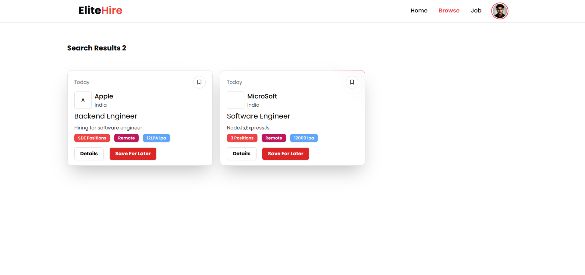
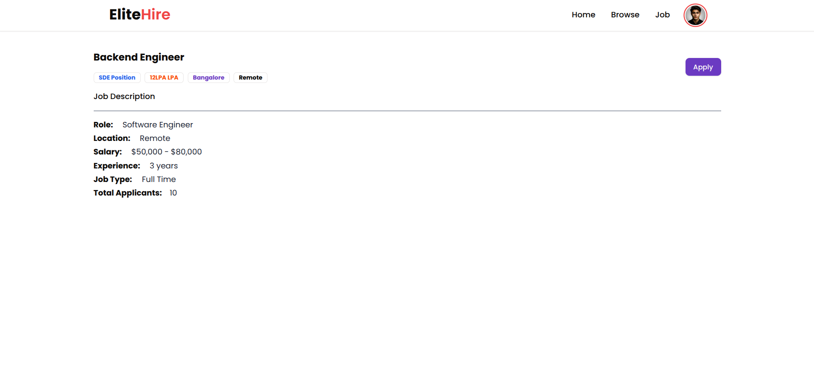
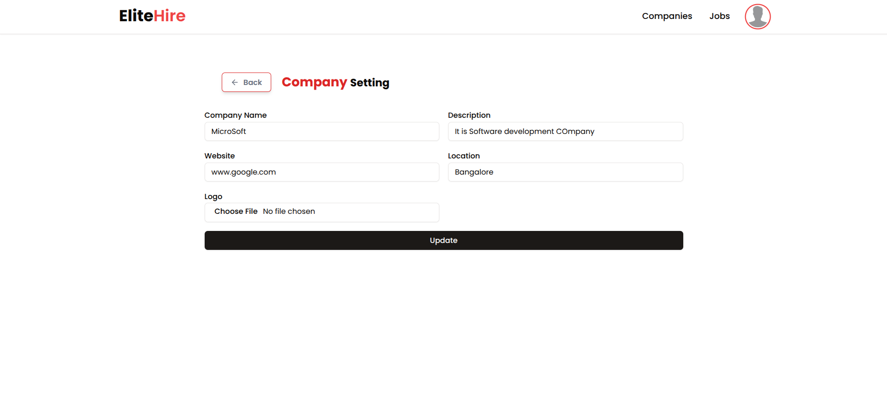
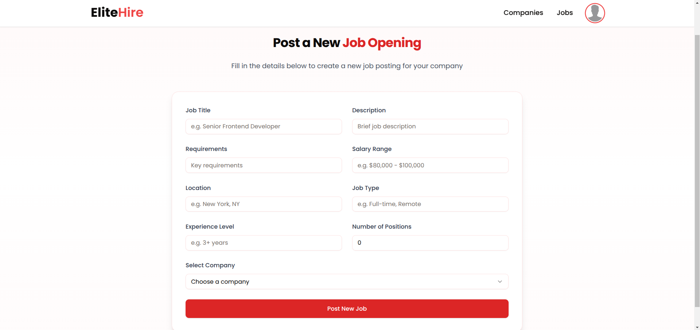

# Elite-Hire

<!-- Add your project banner or logo. Recommended size: 1280x640px -->

Elite-Hire is a job portal platform designed to connect job seekers with top companies. It provides a user-friendly interface for job seekers to browse job opportunities, create profiles, and apply for jobs. The platform also includes features for companies to post job openings and manage applicants.

[//]: # "Add screenshots/GIFs of the application here"


<!-- Add 2-3 screenshots showcasing main features. Recommended size: 1280x720px -->

## Features

- **Job Listings**: Browse job opportunities from top companies
- **Profile Creation**: Create and manage your professional profile
- **Search Functionality**: Easily search for jobs based on various criteria
- **Application Tracking**: Keep track of your job applications
- **Employer Dashboard**: Companies can post job openings and manage applicants

## Tech Stack

### Frontend

- TypeScript
- React.js
- Tailwind CSS
- shadcn UI

### Backend

- Node.js
- Express.js
- MongoDB
- Mongoose
- JWT Authentication

## Installation

### Prerequisites

Before getting started, ensure you have the following installed:

- Node.js (version 14.x or higher)
- MongoDB (local or remote, like MongoDB Atlas)
- Git

### Steps to Get Started

1. **Clone the repository:**

   ```bash
   git clone https://github.com/raulsync/Elite-Hire.git
   ```

2. **Navigate to the project directory:**

   ```bash
   cd Elite-Hire
   ```

3. **Install dependencies for both frontend and backend:**

   ```bash
   # Install backend dependencies
   cd server
   npm install

   # Install frontend dependencies
   cd ../client
   npm install
   ```

4. **Set up environment variables:**

   ```bash
   # In the server directory, create a .env file
   cd server
   touch .env

   # Add the following variables
   PORT=5000
   MONGODB_URI=your_mongodb_connection_string
   JWT_SECRET=your_jwt_secret
   ```

5. **Start the development servers:**

   ```bash
   # Start backend server (from server directory)
   npm run dev

   # Start frontend server (from client directory)
   npm run dev
   ```

## Usage

[//]: # "Add screenshots/GIFs demonstrating usage here"

1. Create a user account
   
   
2. Browse job listings
   
3. Apply for jobs
   
4. Create company profile
   
5. Post job listings
   

<!-- Add screenshots or GIFs showing how to:
Recommended size: 1280x720px -->

### For Job Seekers

1. Create an account or log in
2. Complete your profile with professional information
3. Browse available job listings
4. Apply for positions with your profile
5. Track your application status

### For Employers

1. Create a company account
2. Set up your company profile
3. Post job openings
4. Review and manage applications
5. Communicate with potential candidates

## Contributing

Contributions are welcome! Please feel free to submit a Pull Request.

1. Fork the project
2. Create your feature branch (`git checkout -b feature/AmazingFeature`)
3. Commit your changes (`git commit -m 'Add some AmazingFeature'`)
4. Push to the branch (`git push origin feature/AmazingFeature`)
5. Open a Pull Request
